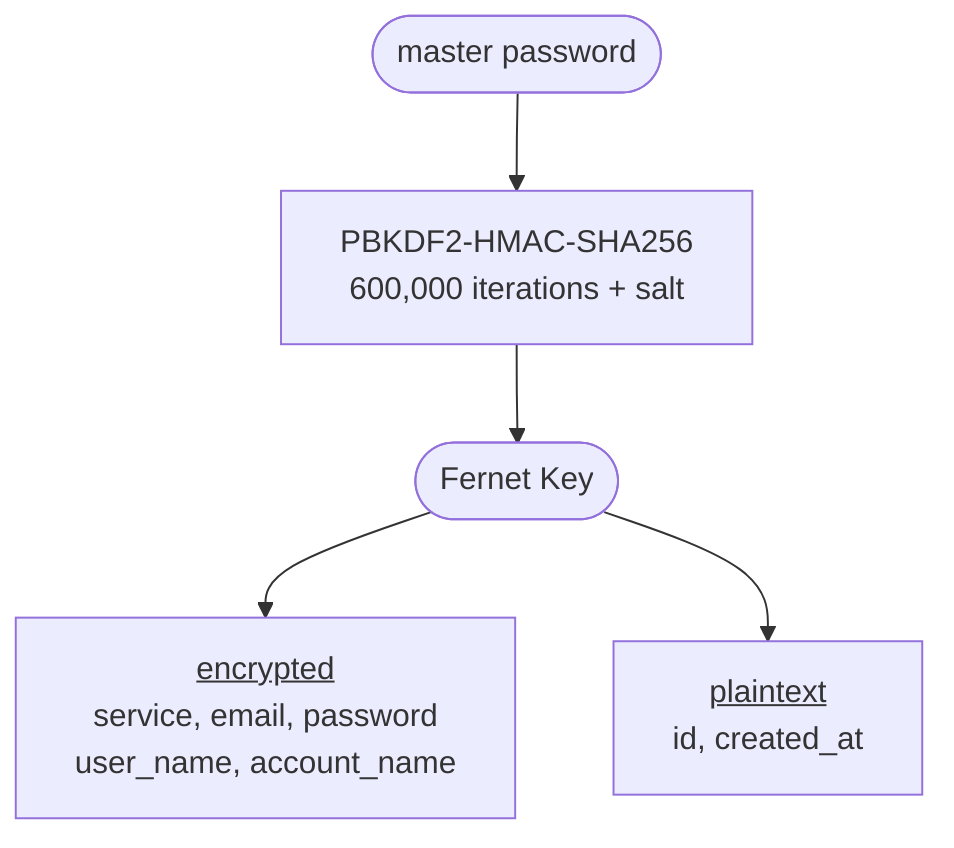

# pswman


A **command-line password manager** written in Python. Credentials are stored in a local SQLite database, encrypted at rest using a master password. No accounts, no cloud, no telemetry. Everything stays on your machine.

---

## Logo

<div align="center">
<pre>
* * * * * * * * * * * * * * * * * * * * * * * * *
*   ______  _____  _             ___   _   _    *
*   | ___ \/  ___|| |   /\  /\  / _ \ | \ | |   *
*   | |_/ /\ `--. | |  |  \/  \/ /_\ \|  \| |   *
*   |  __/  `--. \| |/\| |\/| ||  _  || . ` |   *
*   | |    /\__/ /\  /\  |  | || | | || |\  |   *
*   \_|    \____/  \/  \/   |_/\_| |_/\_| \_/   *
*                                               *
* * * * * * * * PASSWORD  MANAGER * * * * * * * *
*                                               *
*  Password Manager in Python/SQLite            *
*                                               *
*  Version : 0.1.0                              *
*  Author  : Andrea Giuseppe Landella           *
*                                               *
*  (c) 2026 Andrea Giuseppe Landella            *
*  Released under the MIT License               *
*                                               *
* * * * * * * * * * * * * * * * * * * * * * * * *
</pre>
</div>

## How it works

On first run, pswman prompts you to set a **master password**. It derives an encryption key using PBKDF2-HMAC-SHA256 (600,000 iterations) and uses it to encrypt every sensitive field via **Fernet symmetric encryption** before writing anything to disk. The salt and a verification hash are stored inside the database itself, with no separate key files to manage.

Every subsequent run requires the correct master password. An incorrect password is rejected immediately, and *no data is ever decrypted with a bad key*.

The encryption process is described as follows:



> [!WARNING]
> **There is no password recovery mechanism.** If you forget your master password, your data is permanently unrecoverable by design. Store your master password somewhere safe (for example, written down and kept physically secure). Use a long passphrase of four or more random words rather than a short complex password.

---

## Features

- **Encrypted at rest**: sensitive fields are encrypted with Fernet (AES-128-CBC + HMAC-SHA256)
- **Strong key derivation**: PBKDF2-HMAC-SHA256 at 600,000 iterations (OWASP 2023 recommendation)
- **No external key files**: salt and verification hash are stored inside the database
- **Organized storage**: credentials are grouped into named tables (e.g. `personal`, `work`, `banking`)
- **Full CRUD**: add, retrieve, search, update, move, rename, and delete entries
- **Import and export**: CSV and Excel (`.xlsx`) support
- **Safe SQL**: all identifiers are validated; all values are parameterized
- **Secure input**: master password entry uses `getpass` and is never echoed to the terminal

---

## Installation

### 1. Clone the repository

```bash
git clone https://github.com/alandella/pswman.git
cd pswman
```

### 2. Create a virtual environment (recommended)

```bash
python -m venv .venv

# macOS / Linux
source .venv/bin/activate

# Windows (PowerShell)
.venv\Scripts\Activate.ps1
```

### 3. Install dependencies

```bash
pip install -r requirements.txt
```

### 4. Install as a CLI tool

```bash
pip install -e .
```

The `-e` flag installs in **editable** mode: pip points directly at the source directory, so any changes you make to the code are reflected immediately without reinstalling. After this, `pswman` is available as a command from anywhere on your system.

### Uninstall

```bash
pip uninstall pswman
```

Your `passwords.db` file is not affected.

---

## Quickstart

```bash
# Initialize the database
pswman init-db

# Add a table
pswman add-tbl work

# Add a service
pswman add-svc work

# List all services in a table
pswman get-svc work

# Look up a specific service
pswman lkp-svc github
```

---

## Usage

```
usage: pswman [command] [options]

positional arguments:
  <command>
    init-db       initialize the database
    add-svc       add a new service to a table
    add-tbl       add a new table to the database
    get-svc       get all services from a table
    get-tbl       get all tables from the database
    lkp-svc       lookup a service in one or all tables
    lkp-tbl       lookup a table in the database
    upd-svc       update a service in a table
    mov-svc       move a service to a different table
    rnm-svc       rename a service in a table
    rnm-tbl       rename a table in the database
    del-svc       delete a service from a table
    del-tbl       delete a table from the database
    del-esv       delete empty services from a table
    del-all       delete all tables from the database
    del-db        delete the entire database
    exp-tbl       export a table to CSV
    exp-db        export the entire database to CSV
    xls-2db       create a database from an Excel file
    db-2xls       export the entire database to Excel

options:
  -h, --help      show this help message and exit
  -v, --validate  validate the database before running a command
```

Run `pswman <command> -h` for detailed help on any command.

> [!NOTE]
> Most shells log commands to a history file (e.g. `~/.bash_history`, `~/.zsh_history`). pswman never accepts passwords as CLI arguments, but the service names and table names you type will be recorded. Be mindful of this if those names are themselves sensitive.

---

## Command reference

### Database

| Command | Description |
|---|---|
| `init-db` | Initialize a new database. Defaults to `passwords.db` in the current directory |
| `del-db` | Permanently delete the entire database file |

### Tables

| Command | Description |
|---|---|
| `add-tbl <table>` | Create a new table |
| `get-tbl` | List all tables |
| `lkp-tbl <table>` | Check if a table exists |
| `rnm-tbl <old> <new>` | Rename a table |
| `del-tbl <table>` | Delete a table and all its contents |
| `del-all` | Delete all tables |

### Services

| Command | Description |
|---|---|
| `add-svc <table>` | Add a new service entry (interactive prompts) |
| `get-svc <table>` | List all services in a table |
| `lkp-svc <name> [table]` | Search for a service. Omit table to search all |
| `upd-svc <table>` | Update an existing service entry |
| `mov-svc <from> <to> <name>` | Move a service to a different table |
| `rnm-svc <table> <old> <new>` | Rename a service |
| `del-svc <table> <name>` | Delete a service |
| `del-esv <table>` | Delete all empty service entries from a table |

> [!WARNING]
> `get-svc` and `lkp-svc` decrypt and display **all fields in plaintext**, including passwords. Avoid running these commands in public, during screen shares, or while recording your screen.

> [!WARNING]
> `upd-svc` prompts you to re-enter all fields interactively. Leaving a field blank preserves the existing value, but the existing value is **not shown** during editing. Take care not to accidentally clear a field by submitting an empty string.

> [!NOTE]
> pswman does not currently copy passwords to the clipboard. To retrieve a password, use `lkp-svc`; the value will be printed in plaintext. A future `copy-pwd` command could copy directly to the clipboard without displaying the value on screen.

### Import and Export

| Command | Description |
|---|---|
| `exp-tbl <table> [file]` | Export a table to CSV |
| `exp-db [file]` | Export the entire database to CSV |
| `db-2xls [file]` | Export the entire database to Excel |
| `xls-2db <xlsx> [file]` | Import an Excel file as a new database |

> [!WARNING]
> Exported CSV and Excel files contain **decrypted plaintext data**. Anyone with access to an export file can read all credentials without a password. Delete exports when they are no longer needed, never commit them to version control, and add `*.csv` and `*.xlsx` to your `.gitignore`.

---

## Example session

```
$ pswman add-svc work

Master password : ••••••••
Deriving session key.......... done!

Service        github
Email          alice@example.com
Password       ••••••••
User name      alice
Account name   bob

Service 'github' added to table 'work'.
```

```
$ pswman get-svc work

Master password : ••••••••
Deriving session key.......... done!

Retrieved services for table 'work':

Service        github
Email          alice@example.com
Password       correct-horse-battery-staple
User name      alice
Account name   bob
Created at     2026-05-23 10:45:00
```

---

## Security model

pswman is a **local** password manager. Its security rests on three pillars:

- **Master password**: the only secret in the system. Use a strong, unique passphrase of four or more random words.
- **OS-level access control**: the database is only as protected as your user account and file permissions.
- **Full-disk encryption**: strongly recommended (FileVault on macOS, BitLocker on Windows, LUKS on Linux). If your device is stolen while powered off, disk encryption is the last line of defence against someone extracting the database file directly from storage.

> [!TIP]
> pswman has no idle timeout. If you step away from an unlocked machine after running a command, anyone nearby can run further commands without re-entering the master password. Lock your screen whenever you leave your workstation.

What encryption protects against:

| Scenario | Protected |
|---|---|
| Someone steals your `passwords.db` file | Yes, the file is useless without the master password |
| Someone copies `passwords.db` to another machine | Yes, the master password is still required |
| Someone has access to your unlocked machine | No, this is an OS-level concern |
| Someone knows your master password | No |

---

## Dependencies

| Package | Purpose |
|---|---|
| `cryptography` | Fernet encryption and PBKDF2 key derivation |
| `pandas` | Excel import |
| `openpyxl` | Excel export |

```bash
pip install -r requirements.txt
```

---

## Backup

Your entire vault is a single file (`passwords.db`, located in whichever directory you initialized the database). Back it up regularly; losing this file means losing all credentials.

```bash
cp passwords.db ~/Dropbox/passwords.db.bak
```

---

## Contributing

Pull requests are welcome. 
For major changes, please open an issue first to discuss what you would like to change or add.

---

## License

Distributed under the **MIT License**. See the [`LICENSE`](LICENSE) file for details.

&copy; 2026 Andrea Giuseppe Landella
